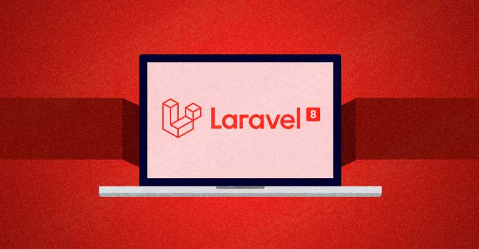
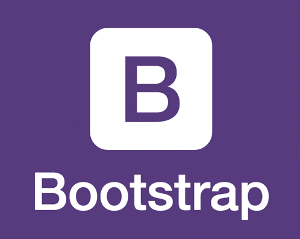
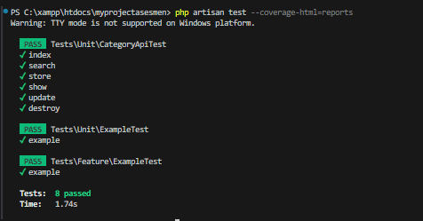

<p align="center"><a href="https://laravel.com" target="_blank"></a>
<a href="https://getbootstrap.com" target="_blank"></a>
</p>

<p align="center">
<a href="https://travis-ci.org/laravel/framework"></a>
<a href="https://packagist.org/packages/laravel/framework"></a>
<a href="https://packagist.org/packages/laravel/framework"></a>
<a href="https://packagist.org/packages/laravel/framework"></a>
</p>

# Dokumentasi Soal Laravel CRUD & REST API

## Cara Instalasi ke Server Lokal :

-   Follow Github Saya
-   Star Repo Github Saya
-   Fork Repo Github Saya
-   Clone project repo saya dengan cara menuliskan pada terminal/cmd/git bash :<br> <b>git clone</b>
``````
git clone https://github.com/haidar180202/my-project-asesmen-laravel.git
`````` 
-   lalu masuk ke direktori repo yg sudah di clone dengan ketik lg pada terminal/cmd/git bash <b>cd my-project-asesmen-laravel.gitn</b>
-   lalu ketik <b>composser install </b> dan <b>php artisan key generate</b>
-   tulis migrate database pada terminal/cmd/git bash : <b>php artisan migrate:install</b>
-   jalankan php artisan db:seed pada terminal/cmd/git bash : <b>php artisan db:seed</b>

<b>Notes :</b> Untuk db:seed jika males untuk mengetikan data, akan dibuatkan langsung oleh laravelnya.

## Fitur Aplikasi Hasil Pengujian

<div style="display: flex;">
  <div style="flex: 50;">
  <center>
  
  </center> 
  </div>
  <div style="flex: 50;">
    <center>
        <video controls width="470">
        <source src="./assetsdocumentasi/myprojectsimulation.mp4" type="video/mp4">
        Your browser does not support the video tag.
        </video>
    </center>
  </div>
</div>


## Detail Permintaan Aplikasi 
### Fitur CRUD API
### Testing API
### Notifikasi Mailtrap.io

## Alat Yang Digunakan Untuk Membuat Web :

-   XAMPP
-   Visual Studio Code
-   Git
-   Cloud (Github)
-   PHP 8.0.28
-   MYSQL 
-   Laravel 8
-   Bootstrap 5
-   Composer
-   Unit Testing


## The Finish Of Decumentation :

### Create By : Muhammad Haidar Shahab

### So if you want know about me so you can see my profile:

[My Github](https://github.com/haidar180202)

[My Gitlab](https://gitlab.com/haidar1802/myapp)

[My Portfolio](https://profile-muhammad-haidar-shahab.netlify.app/)


### The technology have i am use to create the application

    
            